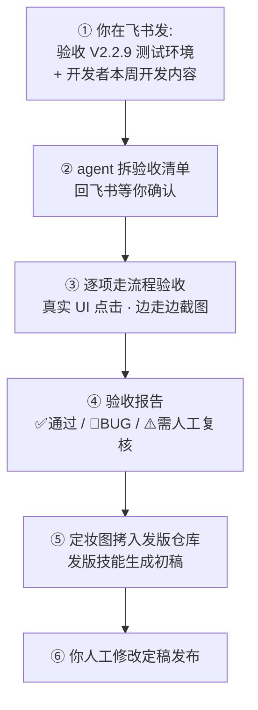

# 51PM 发版验收流程（简版）

> 一句话：**你在飞书发开发内容 → agent 在 51PM 走流程验收出报告和截图 → 发版技能出初稿 → 你人工定稿。**
> 详细背景见 [能力架构与验收方案说明.md](能力架构与验收方案说明.md)。

## 流程总览

## 每一步做什么

| 步骤 | 谁做 | 内容 |
|---|---|---|
| ① 发起 | 你 | 飞书发：`验收 {版本号}，{测试/正式}环境，本周开发内容如下：…`（开发内容可以很糙） |
| ② 确认清单 | agent → 你 | agent 把开发内容拆成验收清单（功能 / 入口 / 计划流程 / 观察点）发回，**你确认后才动手** |
| ③ 执行验收 | agent | 按清单逐项真实 UI 操作走流程，查五个维度：功能正确性、数据正确性、交互体验、文案合理性、边界情况；关键步骤截图，异常必截 |
| ④ 出报告 | agent | `acceptance-report.md`：每项 ✅ / 🐛（复现步骤+预期 vs 实际）/ ⚠️（原因），附截图清单、推断需关注人员、预写【发版素材】段 |
| ⑤ 出发版初稿 | agent | 经你同意后，`final-*.png` 定妆图拷入 `D:\project\51PM发版\51PM-Version\发版最新资源截图\`；发版技能（51pm-release-notes）按验收产出生成版本详情初稿 |
| ⑥ 定稿 | 你 | 人工修改发版内容，更新发布记录表，发布 |

## 前置条件（每次验收前檢查）

1. **automation Chrome 开着**且已登录 51PM（关了就跑 `ensure-chrome.sh`，登录态丢了要手动登一次）
2. **WSL gateway 在跑**（飞书机器人有回应即正常）
3. 功能**已部署到测试环境**（验收默认测试环境 `10.67.8.183:7777`）

## 产物位置

| 产物 | 位置 |
|---|---|
| 验收报告 + 全部截图 | `agent-workspace/acceptance/{版本号}/` |
| 发版用定妆图 | `D:\project\51PM发版\51PM-Version\发版最新资源截图\`（经你确认后拷入） |
| 发版文档 | `D:\project\51PM发版\51PM-Version\发版.md` |

## 相关技能

| 技能 | 位置 | 职责 |
|---|---|---|
| 验收技能 `release_acceptance` | `AgentGroups/BrowserHarness/agent-workspace/domain-skills/51pm/release_acceptance.md` | 走流程、找 BUG、截图、出验收报告 |
| 发版技能 `51pm-release-notes` | `D:\project\51PM发版\51PM-Version\.github\skills\51pm-release-notes\SKILL.md` | 按验收产出写发版内容初稿（格式规范都在里面） |

## agent 验收的边界（哪些还是得你来）

- **权限外页面**：agent 用你的账号，你看不到的它也看不到 → 报告里标 ⚠️
- **时间/后端触发逻辑**（如"超两周自动转暂停中"）：只能验展示层 → 标 ⚠️
- **像素级视觉细节**：agent 初筛，存疑截图给你复核
- **验收产生的测试数据**：报告"待清理"一节会列出，需要你决定是否清理

## 迭代方式

第一轮实测后，把暴露的问题（入口找不到、页面等待超时、清单拆得不准）反馈回来，将入口路径、等待锚点写死进验收技能——越用越稳。
