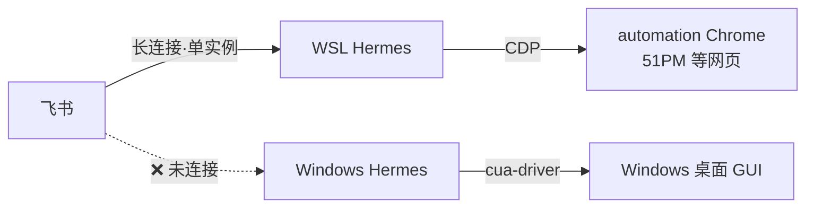

# Hermes 能力架构与 51PM 验收方案说明

> 面向读者：本机部署的使用者（你自己）。
> 目的：一份文档讲清楚——现在有哪几份 Hermes、各自能干什么、"点击"有哪两种、锁屏影响什么、飞书驱动的约束，以及 51PM 发版验收该走哪条路。
> 关联文档：[Windows原生部署记录.md](Windows原生部署记录.md)

---

## 一、现在本机有两份 Hermes

|                                                    | WSL 份                                                        | Windows 原生份                                                |
| -------------------------------------------------- | ------------------------------------------------------------- | ------------------------------------------------------------- |
| 位置                                               | `~/.hermes`（Ubuntu 内）                                      | `C:\Users\dengxinyu\AppData\Local\hermes`                     |
| 版本                                               | v0.18.0                                                       | v0.18.0                                                       |
| 飞书机器人                                         | ✅ 由它负责                                                   | ❌ 不接（见"飞书单实例约束"）                                 |
| 写代码 / 跑脚本 / 定时任务                         | ✅                                                            | ✅                                                            |
| 浏览器自动化                                       | ✅ CDP 遥控 Windows 上的 automation Chrome（51PM 内网已打通） | ✅ 自带 Playwright                                            |
| **操作 Windows 桌面**（真实鼠标/键盘/截屏/开软件） | ❌ 隔着虚拟化边界做不到                                       | ✅ cua-driver 0.7.0，已实测（开记事本、打字、截图）           |
| 日常入口                                           | 飞书 / `wsl` 里跑 `hermes`                                    | PowerShell 里 `hermes`（交互）或 `hermes -z "指令"`（一次性） |

两份完全隔离、互不干扰。

---

## 二、关键概念：Agent 的两种"手"

理解这个，就理解了后面所有结论。

### 手 1：CDP 页内操作（浏览器活）——主力

- **原理**：通过 Chrome DevTools Protocol 直接对**网页里的 DOM 元素**触发事件。"点击 UGA 入口"= `page.click('text=UGA')`，是浏览器内部行为。
- **不动你的鼠标**：你的光标纹丝不动，你可以同时用电脑干别的。
- **不需要看得见屏幕**：浏览器窗口最小化、被遮挡、**锁屏**都照常工作（只要电脑不睡眠/关机，Chrome 进程活着）。
- **精准**：按选择器/文本命中元素，不存在"点偏"。
- **覆盖范围**：点击、输入、下拉、拖拽、键盘快捷键、跳转、截图——网页内的一切。

### 手 2：cua-driver 桌面操作（桌面活）——兜底

- **原理**：控制**操作系统级**的真实鼠标键盘（Win32 SendInput），先截屏→视觉识别→算屏幕坐标→移动光标去点。
- **会抢你的鼠标**：它打字时你不能同时用电脑。
- **锁屏即失效**：SendInput 在锁定会话中无效、截屏黑屏。这是物理限制，无解。
- **精度依赖视觉识别**：可能点偏。
- **用途**：只用于**不是网页**的目标——Photoshop、微信 PC 版等原生 GUI 软件。

> **一句话**：目标在网页里 → 用手 1（快、稳、锁屏不怕）；目标是桌面软件 → 才动用手 2。

---

## 三、飞书驱动的架构约束

1. **飞书单实例约束（硬限制）**：一个飞书应用的事件长连接只能被一个 gateway 接管，双实例同连会抢消息/重复回复。所以飞书只接了 WSL 份。
2. **当前飞书能指挥的**：WSL 份的全部能力 = 终端/文件/脚本 + CDP 浏览器自动化（含 51PM）。
3. **当前飞书指挥不了的**：Windows 桌面 GUI 操作（那在 Windows 份手里）。若要打通，需迁飞书到 Windows 份（迁移成本 + 锁屏限制 + 安全风险放大）或试验 WSL 跨界调用（技术不确定），**目前判断没必要**，理由见下一节。

---

## 四、51PM 发版验收可行性判断

以 V2.2.6 ~ V2.2.8 发版内容逐项分析：

| 发版功能                               | 验收动作                                 | 需要哪只手  |
| -------------------------------------- | ---------------------------------------- | ----------- |
| 项目人员看板 / 模型数据看板 / 产能看板 | 开页面、切维度、下钻列表、核对数字       | 手 1（CDP） |
| 需求"暂停中"状态                       | 列表筛选、状态展示检查                   | 手 1        |
| UGA 一键跳转自动登录                   | 页内点击入口 → 验证跳转 URL + 登录态元素 | 手 1        |
| 验收工作台快捷键 / 进度条              | CDP 注入键盘事件、检查 UI 反馈           | 手 1        |
| 离职人员信息修复                       | 查历史任务核对指派人显示                 | 手 1        |
| 表格拖列宽错位修复                     | CDP 拖拽 → 截图 → LLM 视觉判断           | 手 1        |

**结论：验收项 100% 落在网页内，全部由手 1（CDP）覆盖，不需要 Windows 桌面控制，也就不需要动飞书架构。现有"飞书 → WSL Hermes → CDP → 51PM"链路今天就能干这件事。**

### 真正的限制（不是技术架构，而是这四条）

1. **账号权限**：agent 用你的账号，你的角色看不到的看板（如 DTA 管理员视角）它也看不到。多角色验收需要多个测试账号。
2. **行为类逻辑验不全**："超两周无工时自动转暂停中"是时间触发的后端逻辑，agent 只能验 UI 展示，验不了两周后的自动流转。
3. **视觉判断有误差**：像素级细微错位可能漏判。定位是**初筛**——明显问题直接报，存疑项截图给你人工复核。
4. **验收需要"预期"**：agent 得知道"什么样算对"。发版文档写得越细，验收越准。

---

## 五、推荐落地路径

**不动架构，沉淀一个验收领域技能：**

1. 在 `AgentGroups/BrowserHarness/agent-workspace/domain-skills/51pm/` 新建 `release-acceptance.md`（登录/导航可复用已有 51PM 工时技能）。
2. 技能流程：
   - 输入：发版文档（就像你贴的版本详情）
   - 拆解：按条生成验收清单（功能路径 + 预期表现）
   - 执行：逐条 CDP 走页面验证，每条截图留证
   - 输出：验收报告——每项标 ✅通过 / ❌异常（附截图与差异描述）/ ⚠️需人工复核，发回飞书
3. Windows 份 + cua-driver 保留为兜底，遇到真需要点桌面软件的场景才启用。

### 使用形态（最终效果）

> 你在飞书发：「验收 V2.2.8，发版内容如下：……」
> 几分钟后收到：逐项验收报告 + 截图证据 + 需人工复核清单。
> 全程电脑锁屏也不影响（CDP 不需要屏幕），只要电脑不睡眠。

---

## 六、一页速查

| 问题                        | 答案                                                     |
| --------------------------- | -------------------------------------------------------- |
| 验收 51PM 要用哪份 Hermes？ | WSL 份（飞书已连，CDP 已通）                             |
| 锁屏影响验收吗？            | 不影响（CDP 页内操作），别让电脑睡眠即可                 |
| 什么时候才需要 Windows 份？ | 操作非网页的桌面软件时                                   |
| 飞书能指挥 Windows 桌面吗？ | 目前不能；要打通需迁飞书且接受锁屏/安全代价，暂无必要    |
| 验收的最大短板是什么？      | 不是技术，是账号权限、行为类逻辑、视觉误差、发版文档质量 |
